# Jarkom-Modul-1-ITA04-2022
Nama Anggota | NRP
------------------- | --------------		
Nida'ul Faizah | 5027201064
Kevin Oktoaria | 5027201046
Najwa Amelia Qorry 'Aina | 5027201001

## Soal 1
Sebutkan web server yang digunakan pada "monta.if.its.ac.id"! 

#### Jawab
Pada soal nomer 1, kami menggunakan display filter: `http.host contains monta.if.its.ac.id`

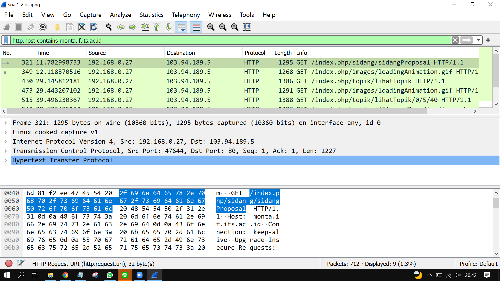

Kemudian pada HTTP kita lakukan TCP Stream dengan klik kanan Follow lalu pilih TCP Stream

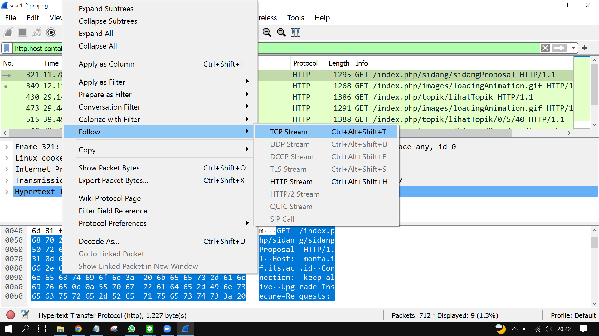

Maka terlihat bahwa web server yang digunakan pada monta.if.its.ac.id adalah: **`nginx/1.10.3`**

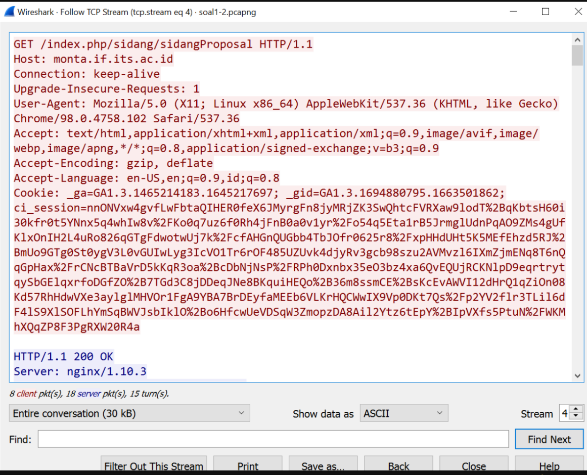

## Soal 2
Ishaq sedang bingung mencari topik ta untuk semester ini , lalu ia datang ke website monta dan menemukan detail topik pada website “monta.if.its.ac.id” , judul TA apa yang dibuka oleh ishaq ?

#### Jawab
Pada soal nomer 2, untuk mengetahui judul TA yang dibuka oleh Ishaq kami menggunakan filter detail: `http.request.uri contains "detail"` sehingga didapat URL dari HTTP yang merujuk pada TA yang diakses. yaitu URLnya: http://monta.if.its.ac.id/index.php/topik/detailTopik/194

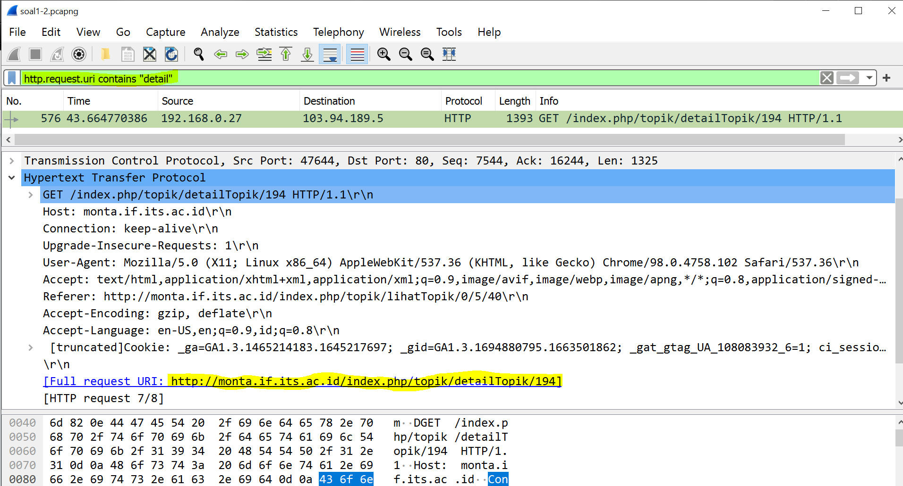

Dengan mengakses URLnya, maka akan dialihkan ke web yang berisi TA yang dibuka Ishaq beserta judulnya: `Evaluasi unjuk kerja User Space Filesystem (FUSE)`

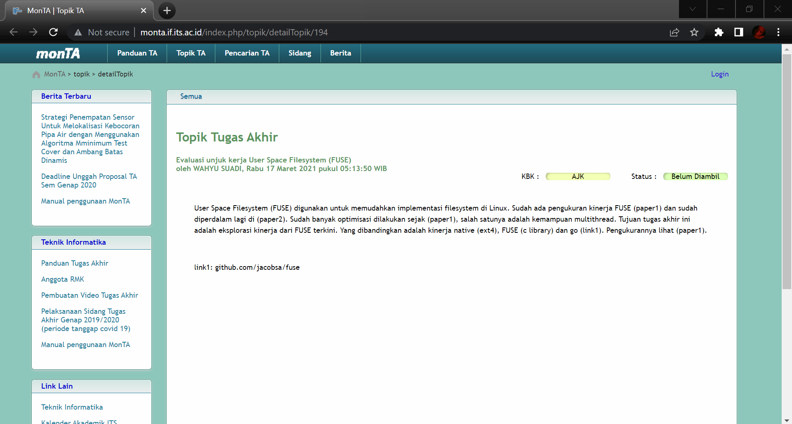

## Soal 3
Filter sehingga wireshark hanya menampilkan paket yang menuju port 80! 

#### Jawab
Menggunakan filter `tcp.port==80` dan muncul source port dan destination port 80, lalu kita filter yang hanya destination port 80 dan ternyata semua yang destination port 80 memiliki destination IP yang sama yaitu 203.160.128.158.

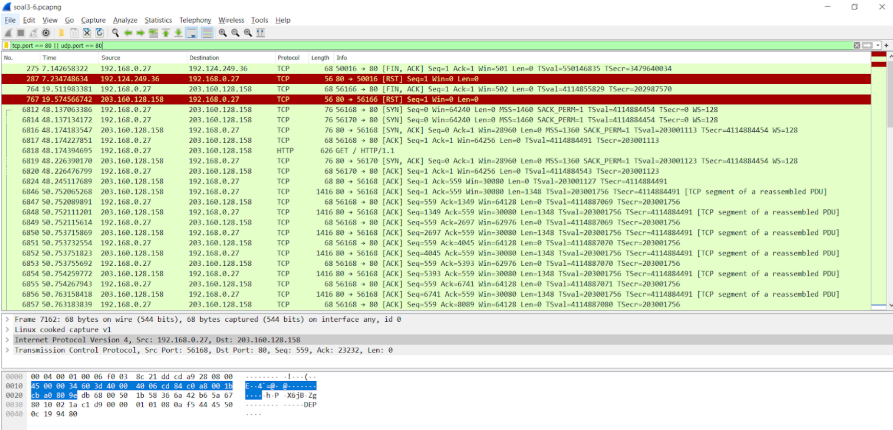

Sehingga kita filter menggunakan `ip.dst==203.160.128.158 && tcp.port==80 || udp.port==80` dan muncul sebanyak 25 paket.

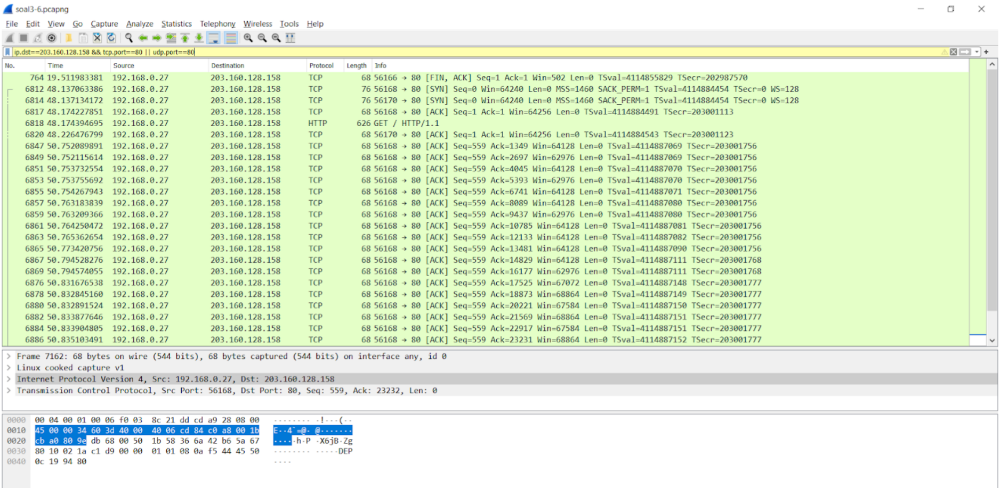

Ternyata terdapat cara lain agar mendapat informasi packet yang lebih lengkap, yaitu dengan cara `tcp.dstport == 80 || udp.dstport==80` dan ternyata terdapat 1 paket yang terlewatkan apabila memakai cara yang pertama karena memiliki destination IP yang berbeda. Sehingga muncul lah sebanyak 26 paket total.

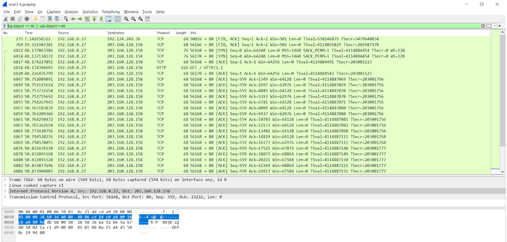

## Soal 4
Filter sehingga wireshark hanya mengambil paket yang berasal dari port 21!

#### Jawab
Menggunakan cara yang hampir sama seperti nomer 3 tetapi apabila pada nomer 3 kita menggunakan `tcp.dstport || udp.dstport`, pada nomer 4 ini kita ganti menjadi `tcp.srcport || udp.srcport` sehingga kita tulis pada filter `tcp.srcport == 21 || udp.srcport == 21` dan muncul sebanyak 73 paket.

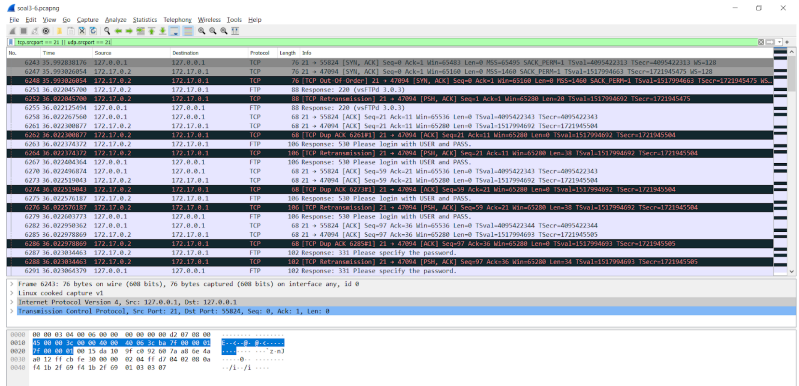

## Soal 5
Filter sehingga wireshark hanya mengambil paket yang berasal dari port 443!

#### Jawab
Pada nomer ini kita menggunakan cara yang sama seperti nomer 4, hanya saja kita perlu mengganti portnya menjadi 443. Filternya adalah `tcp.srcport == 443 || udp.srcport == 443` dan muncul sebanyak lebih dari 100 packet.

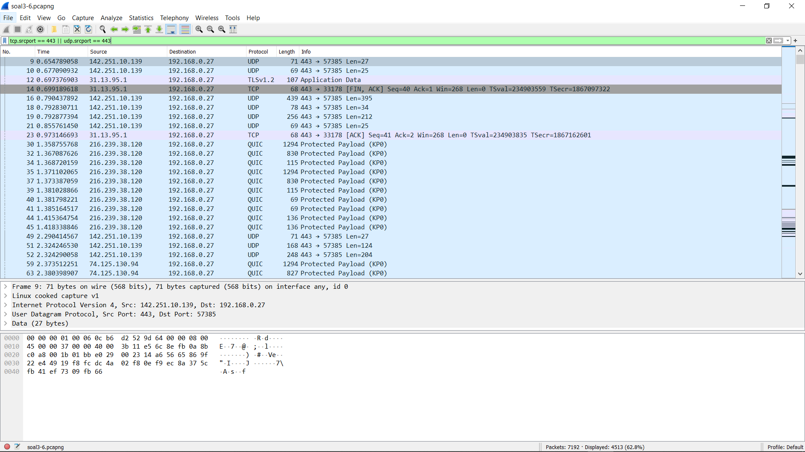

## Soal 6
Filter sehingga wireshark hanya menampilkan paket yang menuju ke lipi.go.id!

#### Jawab
Pada nomer ini kita diberikan sebuah URL yaitu lipi.go.id dan pertama-tama kita perlu mencari IPnya terlebih dahulu. Kita mengecek IPnya pada website IP checker online dan secara tidak sengaja URL yang diberikan memiliki IP yang sama seperti pada nomer 3 yaitu `203.160.128.158`.

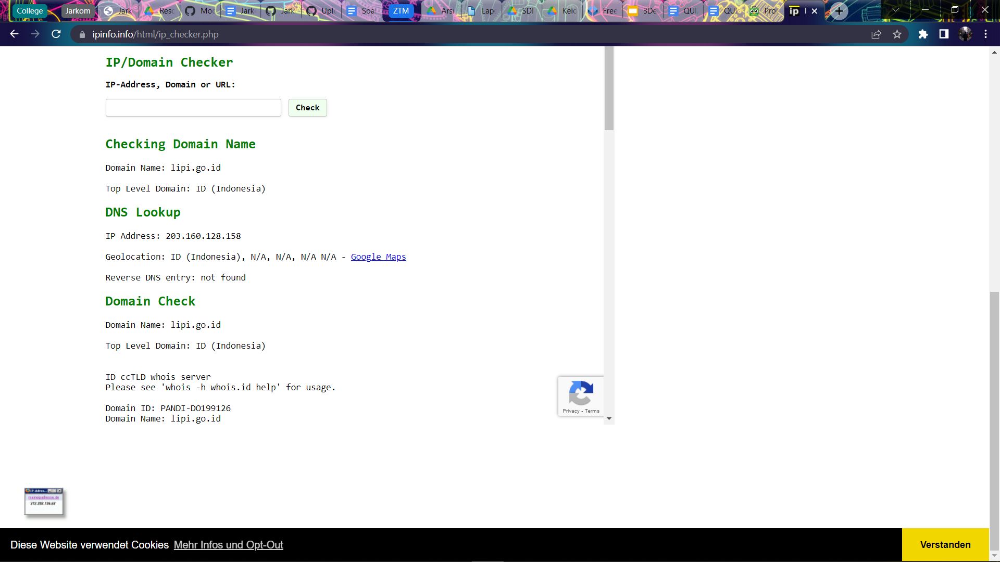

Sehingga kita dapat melakukan filter yang sama yaitu `ip.dst == 203.160.128.158` dan muncul sebanyak 25 packet.

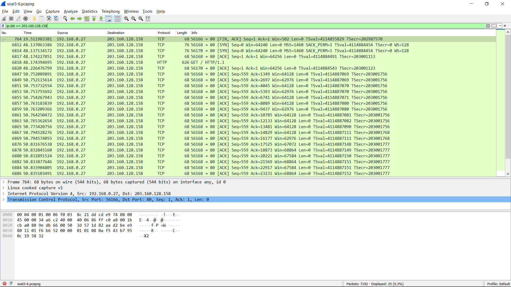

## Soal 7
Filter sehingga wireshark hanya mengambil paket yang berasal dari ip kalian!

#### Jawab
Pertama dimulai dengan membuka command prompt kemudian mengetik `ipconfig` untuk mendapatkan ip address sendiri

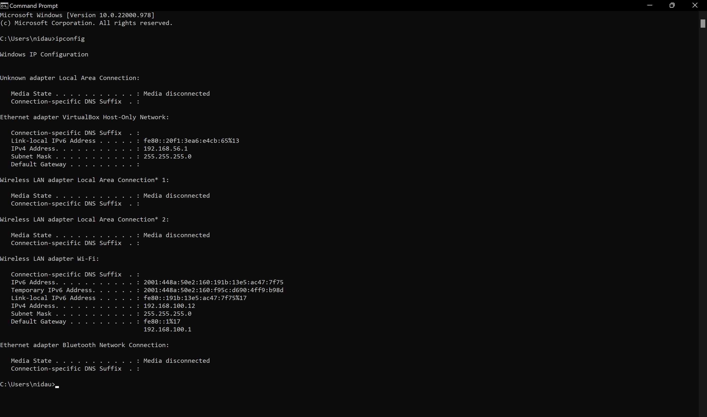

Kemudian kami memasukkan display filter `ip.src == 192.168.100.2`

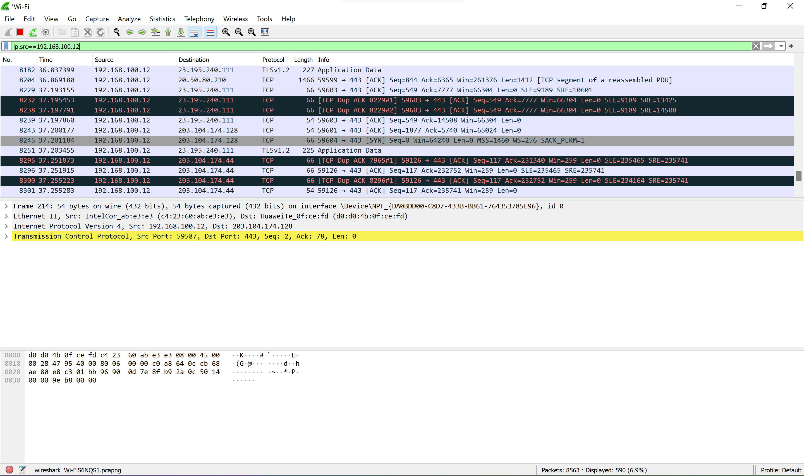

## Soal 8
Telusuri aliran paket dalam file .pcap yang diberikan, cari informasi berguna berupa percakapan antara dua mahasiswa terkait tindakan kecurangan pada kegiatan praktikum. Percakapan tersebut dilaporkan menggunakan protokol jaringan dengan tingkat keandalan yang tinggi dalam pertukaran datanya sehingga kalian perlu menerapkan filter dengan protokol yang tersebut.

#### Jawab

Protokol dengan ciri-ciri yang sudah disebutkan diatas adalah TCP sehingga kami hanya perlu memasukkan display filter `tcp`

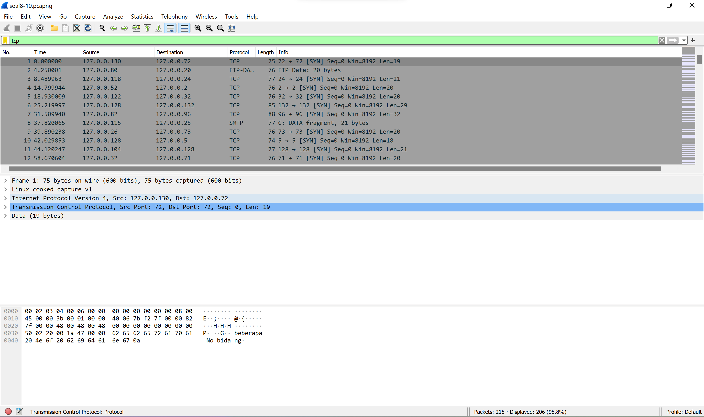

Kemudian pada HTTP kita lakukan TCP Stream dengan klik kanan Follow lalu pilih TCP Stream

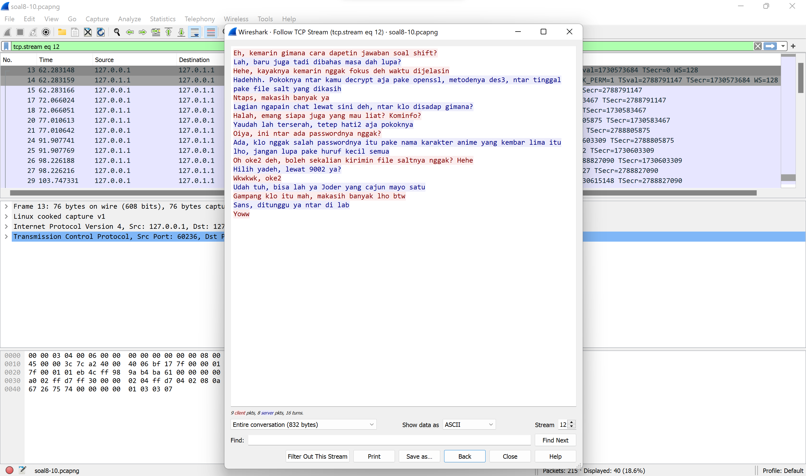
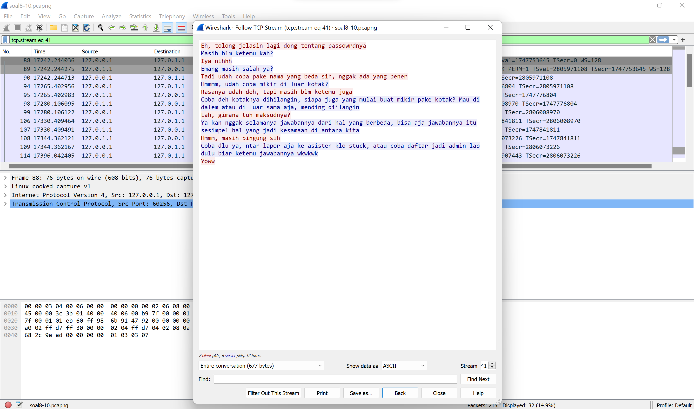
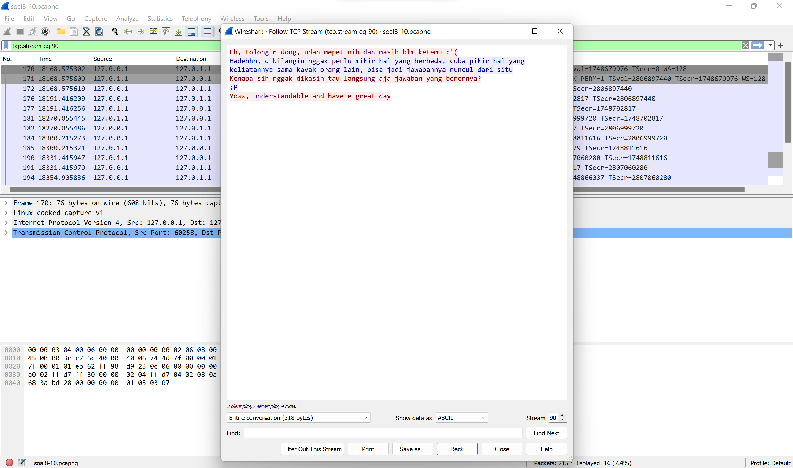

## Soal 9
Terdapat laporan adanya pertukaran file yang dilakukan oleh kedua mahasiswa dalam percakapan yang diperoleh, carilah file yang dimaksud! Untuk memudahkan laporan kepada atasan, beri nama file yang ditemukan dengan format [nama_kelompok].des3 dan simpan output file dengan nama “flag.txt”.

#### Jawab
Berdasarkan ketiga percakapan diatas ditemukan bahwa mereka bertukar file melalui port 9002 maka kami memasukkan display filter `tcp.port==9002` 

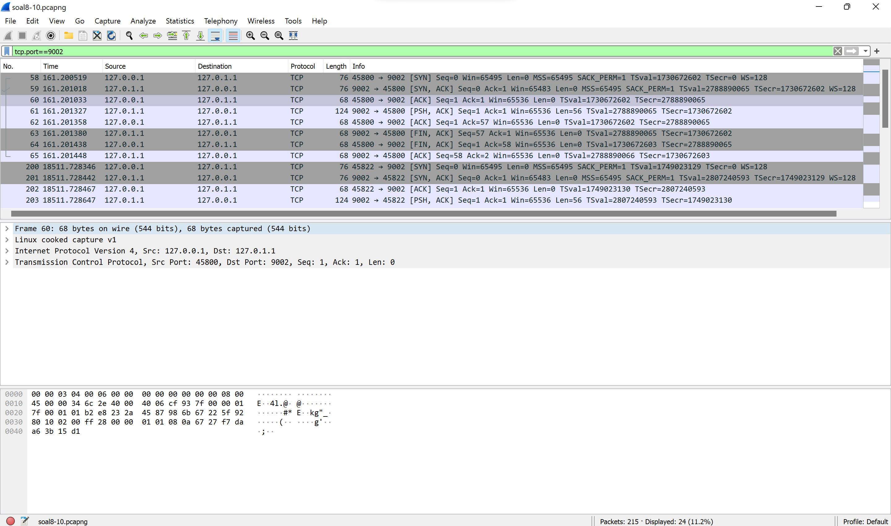

Kemudian lakukan TCP Stream dengan klik kanan Follow lalu pilih TCP Stream hingga menemukan frame yang mengandung kata salted

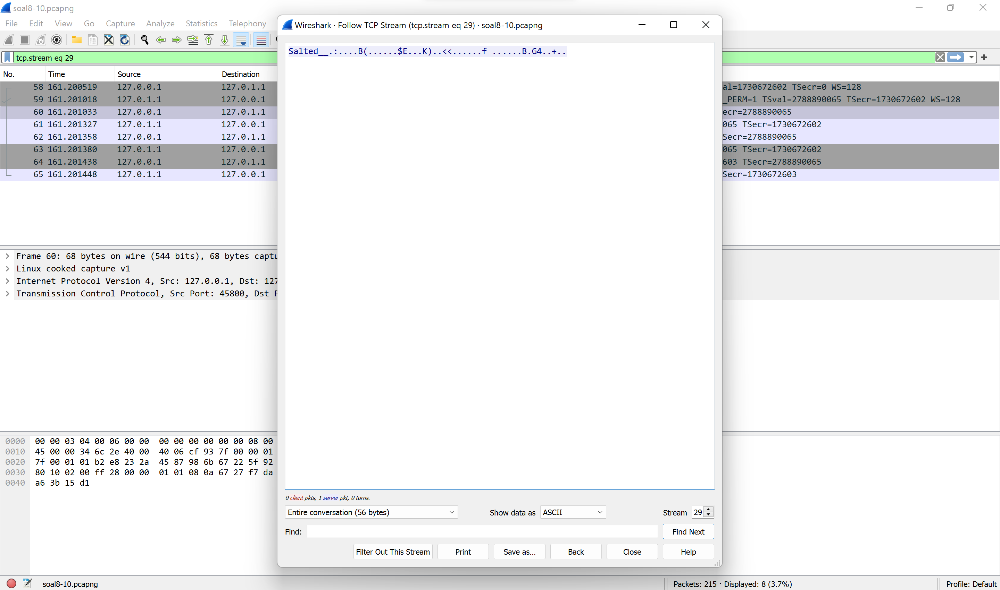

Apabila sudah menemukan, save file as .des3 dan lakukan decrypt berdasarkan percakapan diatas

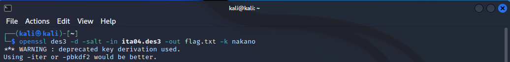
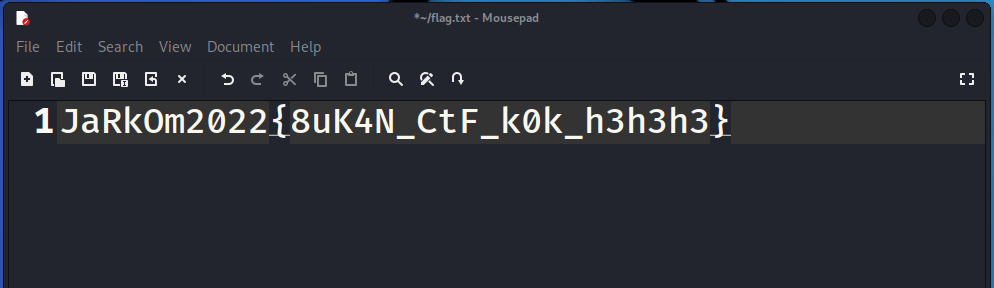

## Soal 10
Temukan password rahasia (flag) dari organisasi bawah tanah yang disebutkan di atas!

#### Jawab

Flag yang dimaksud adalah `JaRkOm2022{8uK4N_CtF_k0k_h3h3h3}`
